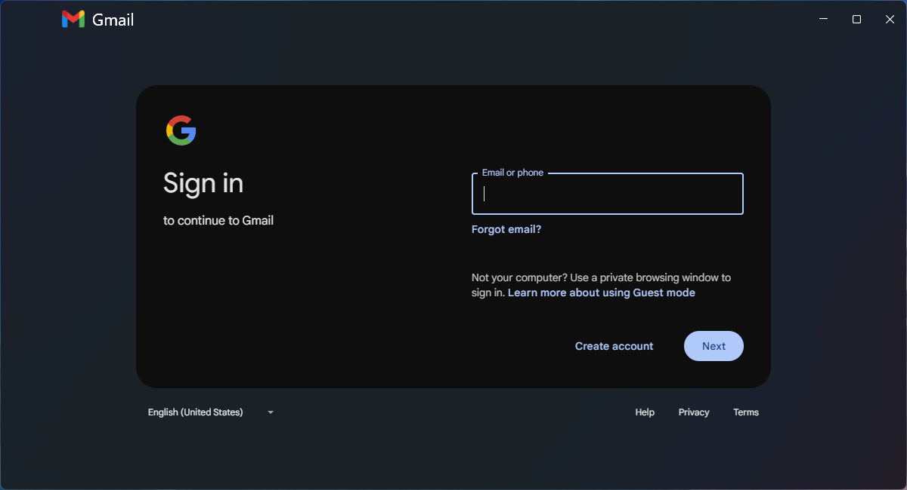
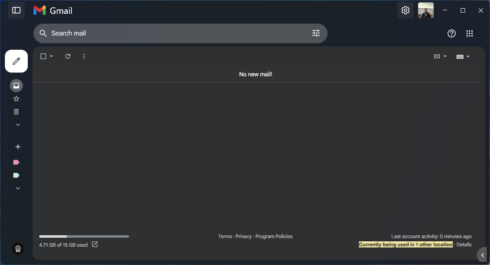
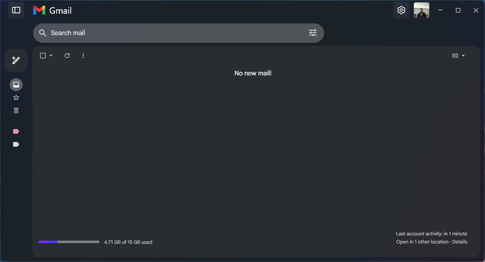

# Fluent-Gmail
Fluent Gmail is a wrapper written in WPF for Gmail that allows you to enhance your experience by introducing Microsoft's Fluent design to the app. The project matches your system's native look and feel, with utilizing mica material. Also transfers some functionality from page to native app.

Each feature in the project is called an integration. Integrations can fix styling and create or move functionality. Most of them are opt-out with a config file.

## Downloading
Get your latest build from [Releases](https://github.com/Segilmez06/Fluent-Gmail/releases/latest) page. Arm64 and x64 supported.

For most users, Windows x64 Standalone would work fine. See the table below to chose which one to use:
| Type       | Description |
| :--------- | :---------- |
| Standalone | All in one package. Contains it's own runtime. Ready to use but bigger file size. |
| Framework  | Requires [.Net Core 9.0.x](https://dotnet.microsoft.com/en-us/download/dotnet/9.0) to be installed. Much less file size. Prefer this if you already have .Net Core installed. |

> [!IMPORTANT]
> I decided not to release x86 builds for this project due to the smaller user base and the architecture being mostly outdated.
> It can still be compiled from source if needed. If you are interested in an x86 builds, please create an issue.

## Installation
No installation required. Just download and extract the archive, then run it.

## Screenshots

#### Default config with no external CSS:

  
Login page

  

  
Inbox

  

#### With some styling, you can get cleaner results like this:

With even more tweaking, you can transform this view to really native looking experience.

## Command Line Arguments
See [Wiki/Command Line Arguments](https://github.com/Segilmez06/Fluent-Gmail/wiki/Command-Line-Arguments) page.

## Custom Styles
You can inject custom styles into your Gmail instance. Create a `custom.css` inside installation location / working directory and put your stylesheet inside. It will automatically gets loaded on startup. Also, all styles gets elevated with `!important` tag to override default styles easily.

## Contributing and Support

For more integration (built-in style and functionality) ideas, just create a feature request.

Any PR and issue is really appreciated. You can show your support by ⭐ starring the repo.

## Credits

Fluent Gmail is created and maintained by [@Segilmez06](https://github.com/Segilmez06).

Frameworks and libraries used in this project:
- [Microsoft Edge WebView 2](https://learn.microsoft.com/en-us/microsoft-edge/webview2/) by [Microsoft](https://github.com/microsoft) - WebView for displaying Gmail page
- [WPF-UI](https://github.com/lepoco/wpfui) by [Lepo.co](https://github.com/lepoco) - Awesome Fluent design library for WPF
- [LottieSharp](https://github.com/quicoli/LottieSharp) by [@quicoli](https://github.com/quicoli) - Lottie Animation viewer for WPF
- [Costura.Fody](https://github.com/Fody/Costura) by [Fody](https://github.com/Fody) - For embedding assemblies inside main executable